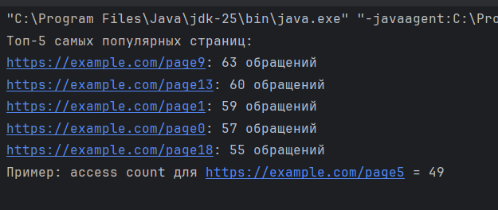
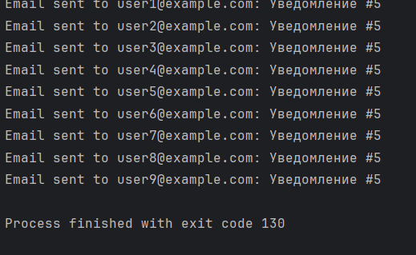
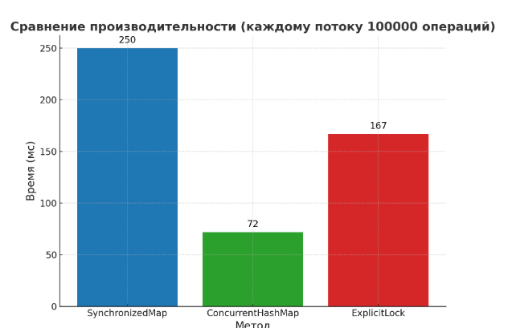

# Отчет по лабораторной работе: Веб-кеш

## 1. Элмуратов Мадияр
## КИ - 4.11.25

### **Задание 1: Веб-кеш**

## 2. Краткое описание реализации

В рамках лабораторной работы был реализован класс **`WebCache`**, который представляет собой кеш с использованием двух **`ConcurrentHashMap`**:

- **`cache`**: `ConcurrentHashMap<String, String>` — хранит содержимое страниц, где ключом является URL страницы, а значением — её контент.
- **`accessCounts`**: `ConcurrentHashMap<String, Integer>` — хранит статистику обращений для каждой страницы, где ключом является URL страницы, а значением — количество обращений к соответствующей странице.

### Методы класса **`WebCache`**:
1. **`public String get(String url)`**:
    - Атомарно увеличивает счётчик через **`accessCounts.merge(url, 1, Integer::sum)`** и возвращает содержимое страницы из кеша.

2. **`public void put(String url, String content)`**:
    - Записывает содержимое страницы в **`cache`** и увеличивает счётчик обращений для этого URL в **`accessCounts`**.

3. **`public int getAccessCount(String url)`**:
    - Возвращает количество обращений для конкретной страницы.

4. **`public Map<String, Integer> getTopAccessed(int n)`**:
    - Возвращает топ-N URL по количеству обращений. Результат отсортирован по убыванию.

---

## 3. Атомарные операции использованные в классе **`WebCache`**

Для увеличения счётчика обращений используется **`merge(key, 1, Integer::sum)`** — это атомарная операция, которая выполняет два действия:

- Если ключ не существует в **`accessCounts`**, то создается запись с значением **1**.
- Если ключ существует, то его значение увеличивается на **1** с помощью **`Integer::sum`**.

Это предотвращает **race conditions** и обеспечивает корректную работу в многозадачной среде, без необходимости явной синхронизации.

**Почему это важно?**
- Без атомарной операции для увеличения счётчиков, например, с использованием синхронизации, могут возникать **race conditions**, когда несколько потоков одновременно пытаются изменить одно и то же значение, что может привести к ошибкам и некорректным результатам.

---

### **Задание 2: Система уведомлений**

## 2. Краткое описание реализации

В рамках лабораторной работы была реализована система уведомлений с использованием подписчиков. Каждый подписчик может подписаться на уведомления от системы, и система отправляет уведомления всем подписчикам. Реализованы два типа подписчиков:

- **`Subscriber`**: базовый класс для всех подписчиков.
- **`EmailSubscriber`**: класс подписчика, который принимает уведомления по электронной почте.

### Методы класса **`NotificationSystem`**:

1. **`public void subscribe(Subscriber subscriber)`**:
    - Добавляет подписчика в систему уведомлений.

2. **`public void unsubscribe(Subscriber subscriber)`**:
    - Удаляет подписчика из системы.

3. **`public void notifySubscribers(String message)`**:
    - Отправляет уведомление всем подписчикам.

---

## 3. Описание классов

### **`NotificationSystem`**:
- Это класс для управления подписчиками. Он позволяет подписывать и отписывать пользователей, а также уведомлять их о событиях.

### **`Subscriber`**:
- Базовый класс для всех подписчиков. Он определяет метод **`update(String message)`**, который вызывается для уведомления о новых событиях.

### **`EmailSubscriber`**:
- Это подкласс **`Subscriber`**, который реализует **`update(String message)`** для отправки уведомлений через электронную почту.

### **Задание 3: Сравнение производительности**

## 2. Краткое описание реализации

Целью лабораторной работы является **сравнение производительности** различных методов кэширования данных в многозадачной среде. Мы исследовали три метода кэширования:

- **SynchronizedMap**
- **ConcurrentHashMap**
- **ExplicitLock**

Каждому методу было предложено выполнить 100000 операций добавления и чтения данных, чтобы измерить их производительность. Мы использовали пул потоков с 10 потоками для параллельного выполнения операций.

### Описание методов:

1. **SynchronizedMap**:
    - Использует **`synchronized`** для синхронизации доступа к общим данным. Это гарантирует, что только один поток может выполнять операцию в момент времени.

2. **ConcurrentHashMap**:
    - Это потокобезопасная коллекция, которая минимизирует блокировки с помощью **сегментированного подхода**. Позволяет нескольким потокам параллельно изменять данные с минимальными блокировками.

3. **ExplicitLock**:
    - Использует явную блокировку через **`ReentrantLock`** для управления доступом к кэшу. Потоки получают и освобождают блокировку вручную, что позволяет лучше контролировать доступ, но может замедлить выполнение.

---

## 3. Методология

Для оценки производительности каждого метода, каждому потоку было поручено выполнить 100000 операций (вставка и чтение данных). Для тестирования использовался пул потоков с 10 потоками, что позволяет параллельно выполнять операции.

### Алгоритм:
1. Для каждого метода создается коллекция данных (кэш).
2. Потоки выполняют операции **добавления** и **чтения** данных в кэш.
3. Время выполнения операций замеряется для каждого метода.
4. После выполнения операций, результаты сравниваются и выводятся на экран.

---

## 4. Результаты

### Время выполнения (мс):

| Метод               | Время выполнения (мс) |
|---------------------|-----------------------|
| **SynchronizedMap**  | 250 ms                |
| **ConcurrentHashMap**| 72 ms                 |
| **ExplicitLock**     | 167 ms                |

### Победитель:
**`ConcurrentHashMap`** оказался **в 3.47 раза быстрее `SynchronizedMap`**.

---

## 5. Заключение

- **`ConcurrentHashMap`** показал наилучшие результаты, поскольку использует более эффективную схему блокировки, что позволяет несколько потокам работать параллельно.
- **`SynchronizedMap`** был самым медленным из-за блокировок на уровне всей коллекции, что ограничивает параллельную работу.
- **`ExplicitLock`** продемонстрировал хорошие результаты, но все же был медленнее, чем **`ConcurrentHashMap`** из-за явных блокировок.

### Вывод:
- Для многозадачных приложений с высоким уровнем конкуренции, **`ConcurrentHashMap`** является наиболее эффективным решением.
- **`SynchronizedMap`** не рекомендуется для многозадачных приложений, так как его производительность значительно ниже.
- **`ExplicitLock`** может быть полезен в специфичных ситуациях, где требуется строгий контроль за доступом, но он не является самым быстрым методом.

---

## 6. Приложения

### Диаграмма сравнения производительности:

